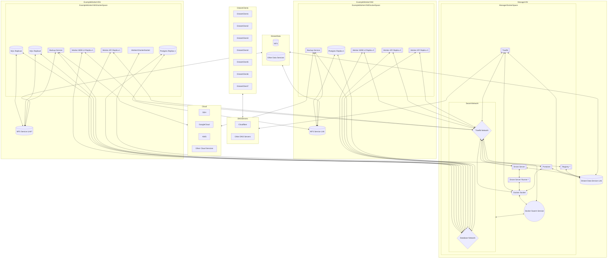

# HDCI

Deployment of traefik, portainer, docker-registry and Drone-CI.

## Requirements

- A domain name (Hosted on Cloudflare)
- A server with a public IP address
- 2GB of RAM minimum (Pipeline takes 1.3GB of RAM)
- A github account
- Docker and docker-compose installed on your server
- git
- At least 2VMs (Recommended 3VMs for fault tolerance)

### Optional but recommended

- NFS share (Or another kind of File sharing service)

I will make the assumption that you will use a NFS share to synchronize the data.

## What it deploys

- Traefik (The reverse proxy that will handle the SSL certificates and the routing)
- Portainer (A docker management UI)
- Docker-Registry (A private docker registry)
- Drone-CI (A CI/CD tool)
- Watchtower (A tool that will update your containers when a new image is available)
- Whoami-Service (A simple service that will return the IP address of the request to test the deployment)

## How to use it

The main goal of this deployment is to be able to deploy a simple CI/CD for your server prod using lightweight tools that are easy to use.

The main idea is to have a git repository with your code, and a git repository with your deployment configuration.

Drone-CI is expected to build images and push them to the registry for all the projects you want to deploy.

Then the repository with the deployment configuration will be used to deploy the images.

If an image is updated, the pipeline will be triggered and the new image will be deployed automatically using Watchtower.

## Setup

### 1. Clone this repository

```bash
git clone git@github.com:HelifeWasTaken/hdci.git
```

### 2. Register drone as an application on github by following this guide

[Drone Github Provider Docs](https://docs.drone.io/server/provider/github/)

The callback URL should be `https://drone.<your-domain>/login`

Please then store your client ID and client secret in a safe place, you will need them later.

### 3. Get your Cloudflare API key

[Create a Cloudflare Token](https://developers.cloudflare.com/fundamentals/api/get-started/create-token/)

### 4. Generate the env file for the deployment

You can use the `configure-deployment.sh` script to generate the `.env` and `docker-data` folder.

```bash
./configure-deployment.sh # To see all required parameters
```

If you want to use multiple managers you can point the folder to a shared NFS folder.

```bash
HDCI_FOLDER=path/to/nfs ./configure-deployment.sh
```

### 5. Make sure your DNS records are set up correctly

You need to have the following DNS records at least:

```txt
A record: <your-domain> -> <your-server-ip>
CNAME record: drone.<your-domain> -> <your-domain>
CNAME record: registry.<your-domain> -> <your-domain>
CNAME record: whoami.<your-domain> -> <your-domain>
CNAME record: portainer.<your-domain> -> <your-domain>
```

### 6. Deploy the stack

#### On the first manager node

```bash
docker swarm init
docker stack deploy -c docker-compose.yml hdci
docker node update --label-add hdci-storage-sync=true "your-manager-node"

# Now login into the registry
docker login registry.<your-domain>
docker node update --label-add hdci-registry-auth=true "your-manager-node"
```

You can check your manager node with the following command:

```bash
docker node ls
```

##### If you have multiple managers (Optional)

This assumes that you configured the deployment or moved the `docker-data` folder to a shared NFS folder.

```bash
docker swarm join --token <your-token> <your-manager-ip>:2377
docker stack deploy -c docker-compose.yml hdci
docker node update --label-add hdci-storage-sync=true "your-manager-node"
docker node update --role manager "your-manager-node"
docker login registry.<your-domain>
docker node update --label-add hdci-registry-auth=true "your-manager-node"
```

#### On the worker nodes

```bash
docker swarm join --token <your-token> <your-manager-ip>:2377

# If you connected the NFS shared folder
docker node update --label-add hdci-storage-sync=true "your-worker-node"

# If you want to use the registry (required if you want the drone runner available there)
docker login registry.<your-domain>
docker node update --label-add hdci-registry-auth=true "your-worker-node"
```

If databases are required make sure to constraint your nodes to the nodes that have a specific label for shared data and to mount your volumes correctly!

If you do not have NFS shared folder, just make sure to have a single node with your own specific label for database nodes!!!

Because of mount propagation, the database nodes should be ensured to be constrained to valid nodes to ensure synchronization.

## Recommended environment example

The HOST VM for the `portainer, traefik, registry, drone-ci`. It deploys all the service on manager that can synchronize data and are part of `traefik_network`.

The Worker VM... Thoses containers are not supposed to use static data and focus solely on quering the databases for processing and storing info.

They could if their node have the label of sync data that you provided but it is not recommended and should use Databses services...

Of course more networks may be used to manage better information

DroneCI should build image and push it to the registry.

Portainer should handle how the deployments are being processed.

This graph implicitly consider that all containers are lied to their local docker socket but for graph simplicity only shows containers that actually use the docker socket for docker commands

If a `*` is present it means that the service is destined by default on the manager but can be moved to a worker node as long as the worker node has the label the `hdci-storage-sync=true` label (MAKE SURE TO MOUNT THE VOLUMES CORRECTLY)

If a `?` is present it means that the service is not required but nice to have. In case you do not use the service you can just assume it is not there...

It is recommended that the distant data is an external disk that is mounted...

The framework does not provide with backup service by default but it is recommended to provide a backup service for the databases.

### Warning

THE LABEL `hdci-storage-sync=true` SHOULD ONLY BE USED IF YOU SYNCHRONIZED THE `HDCI_FOLDER` OTHERWISE IT WILL CREATE DATA LOSS AND INCONSISTENCIES

IF YOU HAVE MULTIPLE MANAGERS MAKE SURE TO ALWAYS SYNCHRONIZE THE `HDCI_FOLDER` TO A SHARED FOLDER

BY DEFAULT THE CONSTRAINTS OF MOST SERVICES WILL IGNORE ANY NODE THAT DOES NOT HAVE THE LABEL `hdci-storage-sync=true`


