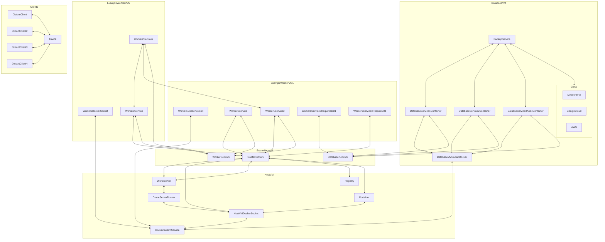

# HDCI

Deployment of traefik, portainer, docker-registry and Drone-CI.

## Requirements :

- A domain name (Hosted on Cloudflare)
- A server with a public IP address
- 2GB of RAM minimum (Pipeline takes 1.3GB of RAM)
- A github account
- Docker and docker-compose installed on your server
- git

For now it will not generate the DNS records for you, but it will create the certificates.

## What it deploys:

- Traefik (The reverse proxy that will handle the SSL certificates and the routing)
- Portainer (A docker management UI)
- Docker-Registry (A private docker registry)
- Drone-CI (A CI/CD tool)
- Watchtower (A tool that will update your containers when a new image is available)
- Whoami-Service (A simple service that will return the IP address of the request to test the deployment)

## How to use it:

The main goal of this deployment is to be able to deploy a simple CI/CD for your server prod using lightweight tools that are easy to use.

The main idea is to have a git repository with your code, and a git repository with your deployment configuration.

Drone-CI is expected to build images and push them to the registry for all the projects you want to deploy.

Then the repository with the deployment configuration will be used to deploy the images.

If an image is updated, the pipeline will be triggered and the new image will be deployed automatically using Watchtower.

## Setup:

### 1. Clone this repository

```bash
git clone git@github.com:HelifeWasTaken/hdci.git
```

### 2. Register drone as an application on github by following this guide:

https://docs.drone.io/server/provider/github/

The callback URL should be `https://drone.<your-domain>/login`

Please then store your client ID and client secret in a safe place, you will need them later.

### 3. Get your Cloudflare API key:

https://developers.cloudflare.com/fundamentals/api/get-started/create-token/


### 4. Generate the env file for the deployment:

You can use the `generate_env.sh` script to generate the `.env` file for drone.

```bash
./generate_env.sh # To see all required parameters
```

### 5. Make sure your DNS records are set up correctly:

You need to have the following DNS records at least:
```
A record: <your-domain> -> <your-server-ip>
CNAME record: drone.<your-domain> -> <your-domain>
CNAME record: registry.<your-domain> -> <your-domain>
CNAME record: whoami.<your-domain> -> <your-domain>
```

### 6. Deploy the stack:

```bash
docker-compose up -d
```

### 7. Test the deployment by connecting:
You can test in order:
 - whoami
 - drone

Then you can connect in ssh to your machine to forward the port 9000 to your local machine to connect to the portainer UI. (Or you can setup a VPN using openvpn to connect to your server).
I would highly discourage you to expose the portainer UI to the internet in any way.

Make also sure that your portainer service is not exposed to the internet otherwise you may need to add asap a firewall to your server.
```bash
# if you use ufw you can use this script to allow only 80/443/22 and disallow everything else
for i in $(ufw status numbered | grep -oP '^\[\d+\].*?(?=\s+\[)|^\[\d+\].*'); do ufw delete $i; done
ufw allow 80
ufw allow 443
ufw allow 22
ufw enable
```

Note:
For mac user 
```
export DISPLAY=0.0
```

If docker login is not possible, install these package
```
sudo apt install dbus-x11 gnupg2 pass
```


I will not cover how to setup a VPN here, but you can find a lot of tutorials on the internet.

To then connect to your portainer UI you can use the following command:
```bash
ssh -L 9000:localhost:9000 <your-user>@<your-server-ip>
```

## Recommended environment example

This environment takes into account that you won't use NFS share for the database and that the VM's are supposedly close to each other for low latency.

The HOST VM for the `portainer, traefik, registry, drone-ci`. It deploys all the service on the local docker but are part of the docker `traefik network`.

The DatabaseVMs handling databases backups and storage and is connected to the DatabaseNetwork through the swarm.

The Worker VM which is connected to the WorkerNetwork to make workers be able to talk to each other... Thoses are not supposed to use static data and focus solely on quering the databases for processing and storing info.

Of course more networks may be used to manage better information

DroneCI should build image and push it to the registry.

Portainer should handle how the deployments are being processed.

